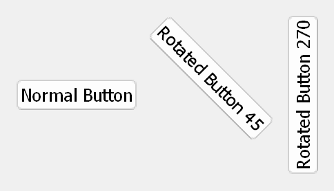

## rotated-widget


**`RotatedWidget`** is a custom PyQt/PySide widget that provides dynamic rotation capabilities for any `QWidget`. It leverages `QGraphicsView` and `QGraphicsProxyWidget` to enable flexible and efficient rotation while maintaining widget functionality and layout properties.

---

### Features
- Rotate any `QWidget` to a custom angle (default is 270 degrees).
- Dynamic resizing with preservation of aspect ratio (optional).
- Seamless integration into PyQt or PySide applications.
- Automatic handling of size policies and layout constraints.

---

### Table of Contents
1. [Installation](#installation)
2. [Usage](#usage)
3. [Examples](#examples)
4. [API Reference](#api-reference)
5. [Use Cases](#use-cases)
6. [Contributing](#contributing)
7. [License](#license)

---

### Installation
1. Clone this repository:
   ```bash
   git clone https://github.com/your_username/RotatedWidget.git
   cd RotatedWidget
   ```
2. Install the required dependencies:
   ```bash
   pip install PySide2  # Or PySide6/PyQt6/PyQt5/PyQt4/PySide based on your preference
   ```
3. Install the package:
   ```bash
   python setup.py install
   ```

---

### Usage
```python
from PySide2.QtWidgets import QApplication, QPushButton, QHBoxLayout, QWidget
from balQt.rotated_widget import RotatedWidget

# Create the application
app = QApplication([])

# Main window setup
window = QWidget()
window.setWindowTitle("Rotated Widget Example")
layout = QHBoxLayout(window)

# Create a normal QPushButton
normal_button = QPushButton("Normal Button")
layout.addWidget(normal_button)

# Create a rotated button
rotated_button = QPushButton("Rotated Button")
rotated_widget = RotatedWidget(rotated_button, angle=270)
layout.addWidget(rotated_widget)

window.show()

# Run application
app.exec_()
```

---

### Examples
#### Example 1: Rotating a Label
Rotate a `QLabel` by 90 degrees and display it in a layout.

```python
from PySide2.QtWidgets import QLabel
label = QLabel("Rotated Text")
rotated_label = RotatedWidget(label, angle=90)
layout.addWidget(rotated_label)
```

#### Example 2: Aspect Ratio Preservation
To maintain the aspect ratio of the widget while rotating:

```python
rotated_widget = RotatedWidget(rotated_button, angle=45, preserve_aspect_ratio=True)
```

---

### API Reference
#### `class RotatedWidget(QWidget)`
A custom widget that rotates a child widget.

**Parameters:**
- `widget (QWidget)`: The widget to be rotated.
- `angle (float)`: The rotation angle in degrees (default is 270).
- `parent (QWidget, optional)`: Parent widget (default is `None`).
- `preserve_aspect_ratio (bool, optional)`: Whether to preserve the original aspect ratio (default is `False`).

**Methods:**
- `__init__(widget, angle=270, parent=None, preserve_aspect_ratio=False)`: Initializes the `RotatedWidget`.
- `sizeHint()`: Returns size hint considering rotation.
- `update_size_policy()`: Adjusts the size policy of the rotated widget.

---

### Use Cases
1. **Dynamic GUI Designs:**
   - Rotate labels, buttons, or other widgets for non-standard layouts.
2. **Control Panels:**
   - Display side-panel controls with rotated text or interactive elements.
3. **Visualization Dashboards:**
   - Rotate custom widgets within graphical data presentations.
4. **Interactive Games or Tools:**
   - Provide unique orientations for game elements or UI tools.

---

### Contributing
Contributions are welcome! To contribute:
1. Fork the repository.
2. Create a new branch (`git checkout -b feature/new-feature`).
3. Commit your changes (`git commit -m "Add new feature"`).
4. Push to the branch (`git push origin feature/new-feature`).
5. Open a pull request.

---

### License
This project is licensed under the MIT License. See the [LICENSE](LICENSE) file for details.

---

### Keywords
- `PyQt`
- `PySide`
- `RotatedWidget`
- `QGraphicsView`
- `QGraphicsProxyWidget`
- `Custom Widgets`
- `GUI Development`
- `Widget Rotation`

---

### Repository Structure
```
StackedWidget/
├── balQt
│   ├── __init__.py
│   ├── rotated_widget.py
│   └── tools.py
├── images
│   └── screenshot.png
├── .gitignore          # Ignore artifacts
├── example.py          # Usage example
├── LICENSE             # License file
├── README.md           # Documentation
└── setup.py            # Setup file
```

